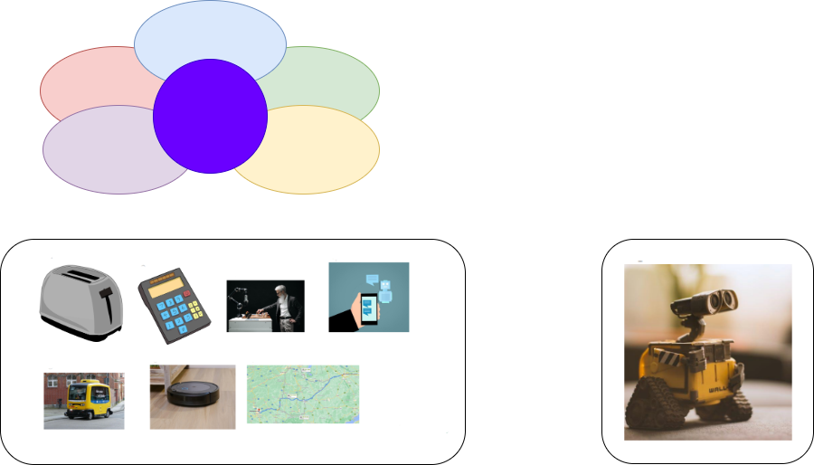

# Was ist eigentlich (Künstliche) Intelligenz?
Wir lernen uns kennen und versuchen gemeinsam, künstliche Intelligenz zu definieren.

## Ablauf
Es gibt zwei Bestandteile der Lerneinheit:

1. Gegenseitiges Kennenlernen und Gründe für den Besuch der AG
2. Versuch einer Definition: was ist künstliche Intelligenz?

## Benötigte Materialien
| Gegenstand          | Beschreibung                        | Bezugsquelle                        |
|---------------------|-------------------------------------|-------------------------------------|
| Folien Enaris: AI Basics  | Einführungsfolien des Enaris-Projekts | [enaris.org](http://enaris.org) |

## Unterrichtsvorbereitung

### Anfangssetup
* Per Beamer oder Whiteboard die beiden Fragen groß darstellen:
  1. Warum bin ich hier? Interessiere ich mich für das Thema (warum?) oder haben meine Eltern mich angemeldet?
  2. Was glaube ich hier zu lernen?
* Jeder Schüler soll diese Fragen kurz beantworten.

Der Leiter sollte versuchen, auf jede der Antworten einzugehen und als Input für die weitere Gestaltung der Stunde und der gesamten Lerneinheit zu nehmen.

Danach geht der Leiter auf die Folien von enaris über. 

## Unterrichtsdurchführung

Unterschiedliche Formen der Intelligenz werden anhand der Folien erläutert. 

Die Kinder sollen jede Form einschätzen, es wird im Verlauf sehr schwierig werden, die "Stärke" der jeweiligen künstlichen Intelligenz einzuschätzen.

Zur Auflösung des Problems wird die Landschaft der KI vorgestellt.

Schließlich wird auf Walle eingegangen, die einzig (nicht) existierende starke Intelligenz.

Anhand dieser werden die Unterschiede zwischen starker und schwacher Intelligenz erläutert.

## Wiederholungseinheit

* Was sind die unterschiedlichen Formen der Intelligenz?
* Wie waren die unterschiedlichen Formen ausgeprägt?
* Was ist der Unterschied zwischen starker und schwacher KI?

## Ressourcen
* [enaris.org](http://enaris.org)

