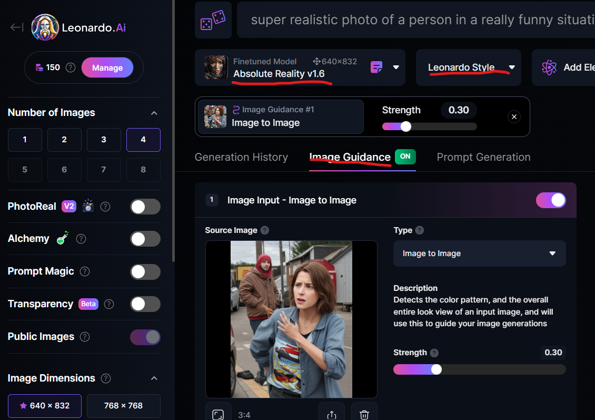
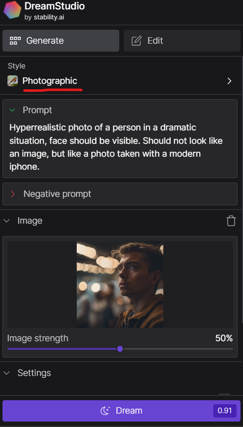

# Deepfakes erstellen und erkennen

Wie können wir Deepfakes selber erstellen und wie können wir manipulierte Bilder erkennen?

## Ablauf

Es sollen zwei unterschiedliche Aspekte von Deepfakes behandelt werden:

1. Wie können wir Deepfakes und manipulierte Bilder erkennen?
2. Wie können wir solche Bilder selber erstellen?

### Erkenne Fälschungen

Wir besuchen unterschiedliche Webseiten mit Deepfakes und versuchen, Eigenschaften von echten und manipulierten bzw. KI-erstellten Bildern zu erkennen.

### Erstelle Fälschungen

Zunächst mit Bildern, dann mit Videos.

## Benötigte Materialien

| Gegenstand | Beschreibung | Bezugsquelle |
|---------------------|-------------------------------------|-------------------------------------|
| chat.openai.com | Dallee3 by ChatGPT | |

## Unterrichtsvorbereitung

Wir müssen uns bei allen unter "Benötigte Materialien" erwähnten Seiten anmelden und Accounts erstellen.

## Unterrichtsdurchführung

### Einführung in Deepfakes

* https://player.schule/youtube/vvKXL7-y08U

### Erkenne Fälschungen bei Bildern

* https://data.wdr.de/ddj/deepfake-quiz-erkennen-sie-alle-ki-bilder/
* https://data.wdr.de/ddj/quiz-wie-gut-erkennen-sie-deepfakes/
* https://detectfakes.kellogg.northwestern.edu/
* https://www.cnet.com/pictures/ai-or-not-ai-can-you-spot-the-real-photos/10/
* https://data.wdr.de/ddj/deepfake-quiz-erkennen-sie-alle-ki-bilder/
* https://www.zdf.de/kinder/logo/deep-fakes-erkennen-100.html
* https://deepfact.3duniversum.com/quiz/

Wir nutzen nacheinander chatcpt.com, bing.com, dreamstudio und leonardo.ai zur Erstellung von möglichst realistischen Fotos.

### Erkenne Fälschungen bei Videos

#### Videos

* Sora: https://seo.ai/blog/openai-sora-examples

#### Videos 

* _Willkommen bei der KI4Kids AG_: https://app.synthesia.io/#/video/06544ab4-3831-4ada-8179-22698bb824ef?version=1

### Erstelle ein Katastrophenbild

Folgender Prompt wird für alle Tools verwendet:

> Hyperrealistic photo of a person watching a nearby volcanic eruption. Face must be clearly identifiable and look very realistic with natural expressions. The photo should be taken with a very high-quality camera to ensure maximal realism and detail.

#### bing.com / chatgpt.com

#### Leonardo.ai

* Einstellungen bei https://app.leonardo.ai/ai-generations/image-guidance

#### Dreamstudio

* Einstellungen bei https://dreamstudio.ai/generate

