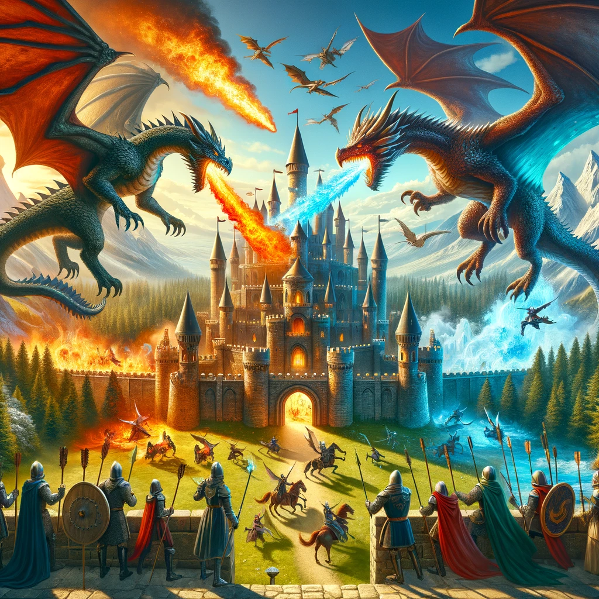
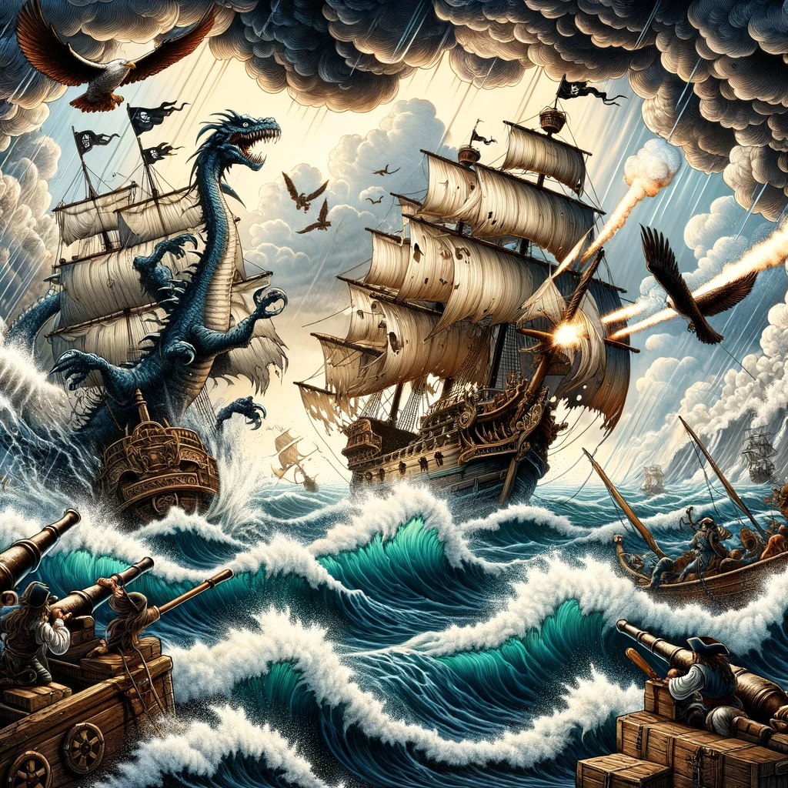
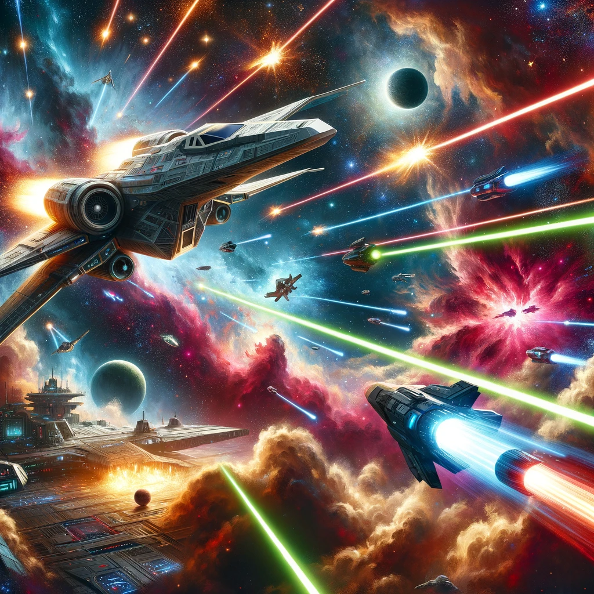
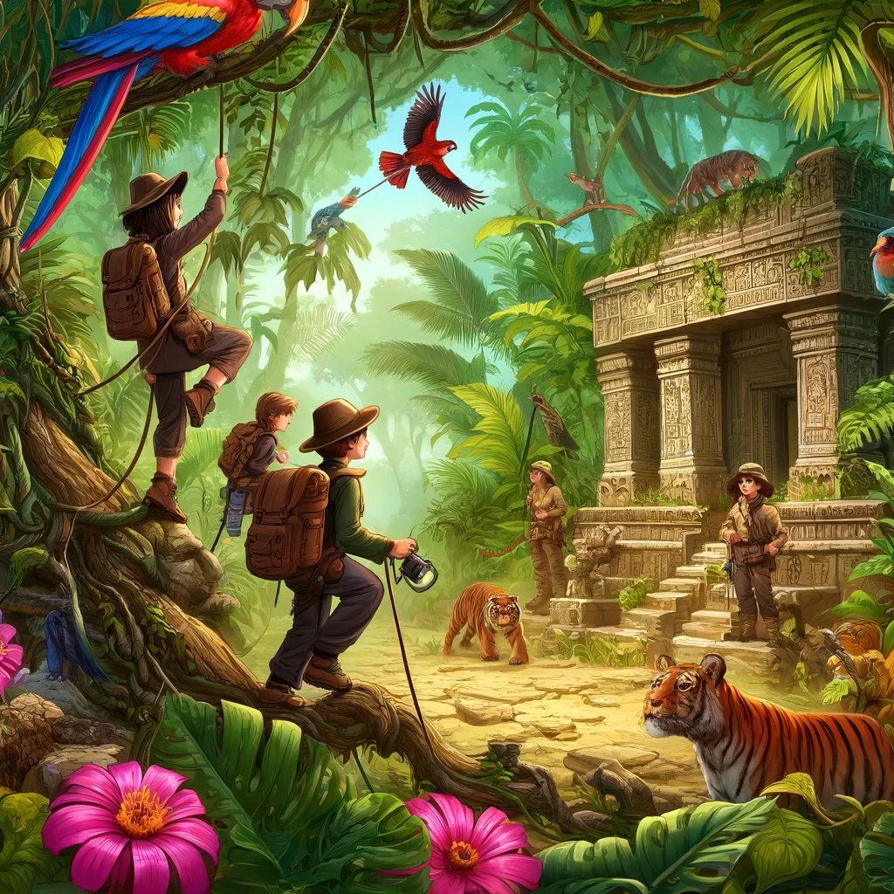
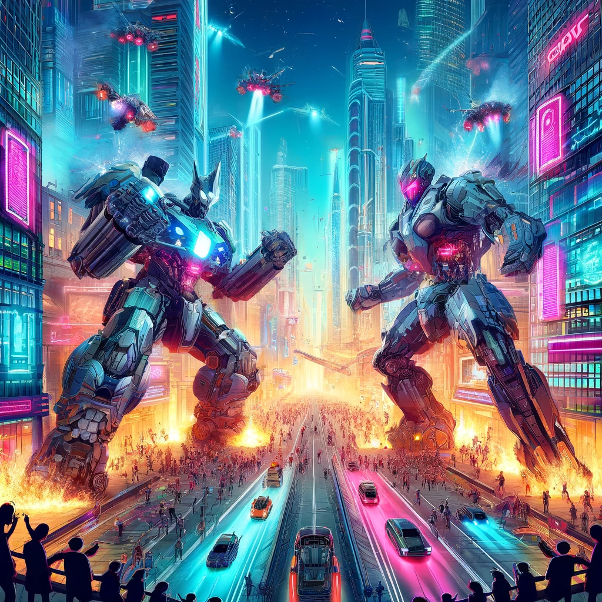

# Rate den Prompt für dieses Bild!

Wie erstellt man einen Prompt für ein Bild?  
Was ist dabei wichtig?

Wir nutzen Beispielbilder, um gute Prompts zu erstellen.

## Ablauf

## Benötigte Materialien

| Gegenstand | Beschreibung | Bezugsquelle |
|---------------------|-------------------------------------|-------------------------------------|
| chatGPT | ChatGPT | chatgpt.com |

## Unterrichtsvorbereitung

* Wie können die Bilder am besten erstellt werden?
* Welche Hinweise können wir den Kindern geben?
* Wie verändern sich die Bilder bei unterschiedlichen Prompts?
* Wie kann man den interaktiven Modus am besten nutzen?

## Unterrichtsdurchführung

Diese Bilder sollen erstellt werden. Die Schüler versuchen, den besten Prompt dafür zu finden.

Es sind mögliche Prompts angegeben, aber der Fantasie der Kinder sind keine Grenzen gesetzt, die Kinder sollen beurteilen, welche der selbst erstellten Prompts ein Bild erzeugen, dass den vorgegebenen Bildern am meisten ähnelt.

### Drachenkampf

> Ein fesselnder Fantasy-Drachenkampf über einer mittelalterlichen Burg, bei dem feuerspeiende und eisatmende Drachen gegeneinander antreten.

### Piratengefecht

> Ein aufregendes Piratenabenteuer auf stürmischer See mit kämpfenden Schiffen und einem riesigen Seeungeheuer.

### Raumschiffabenteuer

> Eine spannende Weltraumschlacht mit hochmodernen Raumschiffen, die sich in einem epischen Lasergefecht befinden.

### Dschungelexpedition

> Eine aufregende Dschungel-Expedition, bei der junge Entdecker eine verborgene Tempelruine entdecken und von wilden Tieren umgeben sind.

### Cyberschlacht

> Eine intensive futuristische Roboter-Showdown-Szene in einer belebten Cyberpunk-Stadt mit Neonlichtern und Wolkenkratzern.