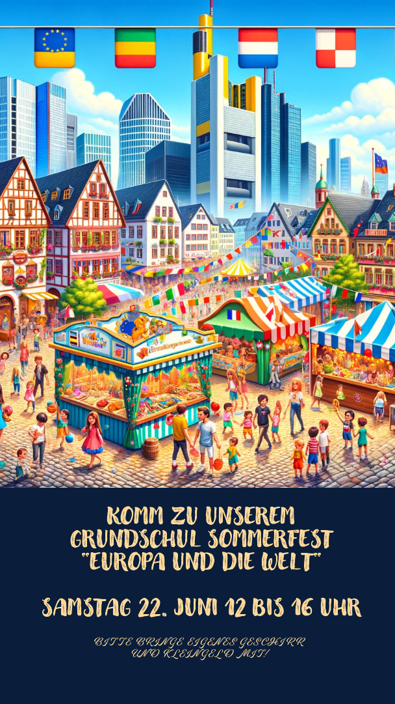

# Flyer für das Schulsommerfest erstellen

Wir erstellen einen Flyer für das Sommerfest an einer Grundschule in Frankfurt mit dem Thema "Europa und die Welt".

## Ablauf

## Benötigte Materialien

| Gegenstand | Beschreibung | Bezugsquelle |
|---------------------|-------------------------------------|-------------------------------------|
| ChatGPT | ChatGPT | chatgpt.com |
| Microsoft Designer | KI-unterstütztes Designprogramm | designer.microsoft.com |

## Unterrichtsvorbereitung

## Unterrichtsdurchführung

* Iterative Erstellung des Bildes mit ChatGPT/DALL-E
* Erstellung des Flyers mit Microsoft Designer
  
