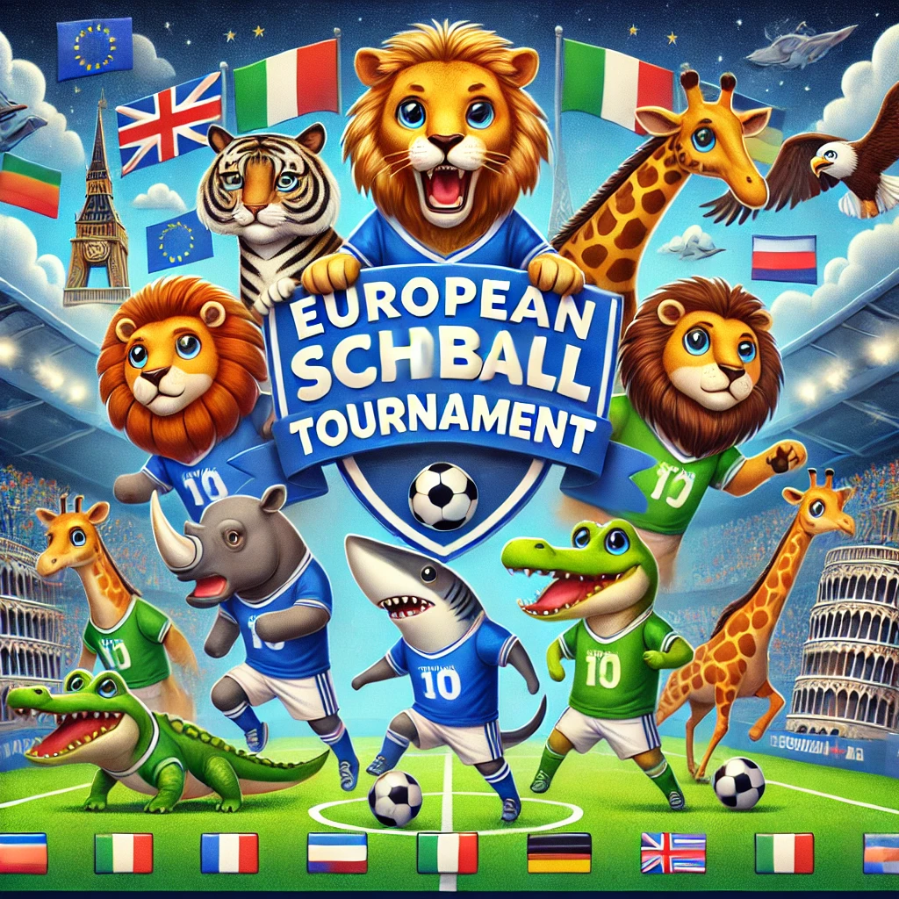

# Wir wollen ein Fussballturnier planen

Es soll ein Fussballturnier an der Grundschule stattfinden. Wir wollen eine Planung für die einzelnen Spiele mit Gruppen- und KO-Runden. Außerdem wollen wir ein Plakat erstellen mit den wichtigsten Informationen.

## Ablauf

## Benötigte Materialien

| Gegenstand | Beschreibung | Bezugsquelle |
|---------------------|-------------------------------------|-------------------------------------|
| ChatGPT | ChatGPT | chatgpt.com |
| Microsoft Designer | Erstellung von Flyern, Postern und Plakaten | designer.... |

## Unterrichtsvorbereitung

## Unterrichtsdurchführung

> Es soll ein Fussballturnier veranstaltet werden, es gibt die Klassen 1-4. Die Klassen sind jeweils eine Gruppe, Gruppe 1 hat 4 Klassen, alle anderen 3. Alle Klassen einer Gruppen spielen gegeneinander. Die Spiele dauern 20 min, mit 5 Minuten Pause. Es können zwei Spiele parallel stattfinden. Es soll an zwei Tagen jeweils ab 10 Uhr gespielt werden. Plane alle Begegnungen, sowie Achtel-/Viertel-/Halb- und Finale. Ordne die Klassen vorher Tieren zu, wähle eine tabellarische Darstellung. 

### Beispielergebnis

### Klassen und ihre Tiere
- Klasse 1A: Löwen
- Klasse 1B: Tiger
- Klasse 1C: Elefanten
- Klasse 1D: Giraffen
- Klasse 2A: Krokodile
- Klasse 2B: Nashörner
- Klasse 2C: Zebras
- Klasse 3A: Adler
- Klasse 3B: Falken
- Klasse 3C: Eulen
- Klasse 4A: Haie
- Klasse 4B: Delfine
- Klasse 4C: Wale

### Spielplan - Gruppenphase

#### Tag 1: Samstag

**Gruppe 1 (Klassen 1A, 1B, 1C, 1D) und Gruppe 2 (Klassen 2A, 2B, 2C)**

| Zeit      | Begegnung (Feld 1)   | Begegnung (Feld 2)       |
|-----------|----------------------|--------------------------|
| 10:00     | Löwen vs Tiger       | Krokodile vs Nashörner   |
| 10:25     | Elefanten vs Giraffen| Nashörner vs Zebras      |
| 10:50     | Löwen vs Elefanten   | Krokodile vs Zebras      |
| 11:15     | Tiger vs Giraffen    | -                        |
| 11:40     | Löwen vs Giraffen    | -                        |
| 12:05     | Tiger vs Elefanten   | -                        |

**Gruppe 3 (Klassen 3A, 3B, 3C) und Gruppe 4 (Klassen 4A, 4B, 4C)**

| Zeit      | Begegnung (Feld 1)   | Begegnung (Feld 2)       |
|-----------|----------------------|--------------------------|
| 12:30     | Adler vs Falken      | Haie vs Delfine          |
| 12:55     | Falken vs Eulen      | Delfine vs Wale          |
| 13:20     | Adler vs Eulen       | Haie vs Wale             |

### K.O.-Phase

#### Tag 2: Sonntag

| Zeit      | Begegnung (Feld 1)          | Begegnung (Feld 2)          |
|-----------|-----------------------------|-----------------------------|
| 10:00     | Achtelfinale 1 (Sieger G1 vs Zweiter G4) | Achtelfinale 2 (Sieger G2 vs Zweiter G3) |
| 10:25     | Achtelfinale 3 (Sieger G3 vs Zweiter G2) | Achtelfinale 4 (Sieger G4 vs Zweiter G1) |
| 10:50     | Viertelfinale 1 (Sieger AF1 vs Sieger AF2) | Viertelfinale 2 (Sieger AF3 vs Sieger AF4) |
| 11:15     | Halbfinale 1 (Sieger VF1 vs Verlierer VF2) | Halbfinale 2 (Sieger VF2 vs Verlierer VF1) |
| 11:40     | Finale (Sieger HF1 vs Sieger HF2) | -                        |

> Dieses Turnier wird von einer Europaschule veranstaltet. Erstelle ein lustiges Bild für ein Plakat mit den Tieren und dem Bezug zu Europa.

> Entferne allen Text. Ergänze einen Bezug zur Stadt Frankfurt.

