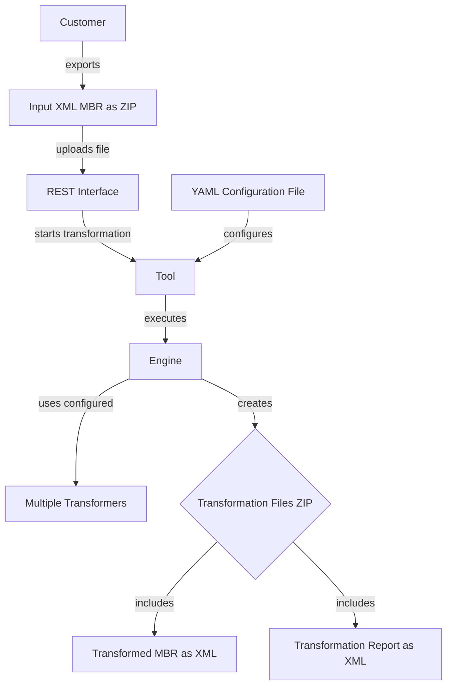

```mermaid
graph TD
    B[REST Interface] -->|starts transformation| C[Tool]
    C[Tool] -->|executes| D[Engine]
    D[Engine] -->|uses configured| E[Multiple Transformers]
    D[Engine] -->|creates| F{Transformation Files}
    F{Transformation Files ZIP} -->|includes| G[Transformed MBR as XML]
    F{Transformation Files ZIP} -->|includes| H[Transformation Report as XML]
    I[YAML Configuration File] -->|configures| C[Tool]
    A[Customer] -->|exports| J[Input XML MBR as ZIP]
    J[Input XML MBR as ZIP] -->|uploads file| B[REST Interface]
```
